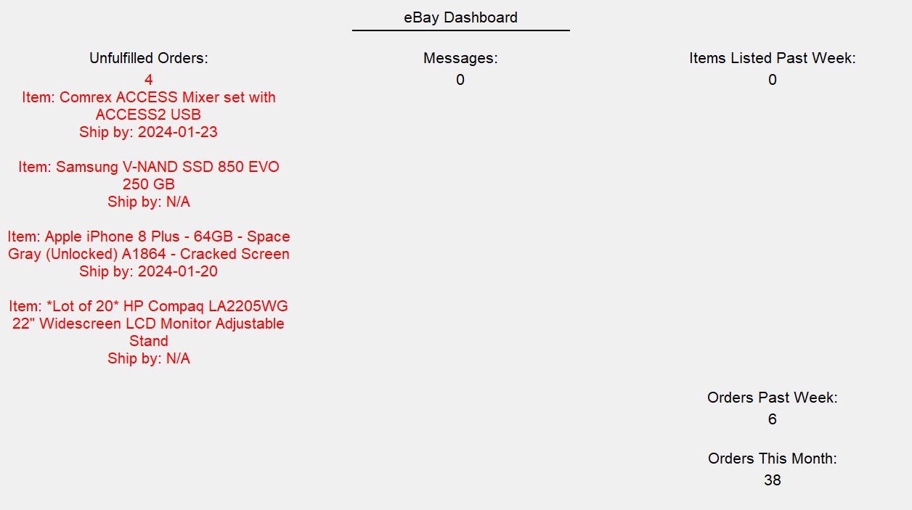

# eBay Dashboard.

## Elevator pitch
This will be a dashboard integrating with eBay's REST API to show current information about the eBay store, as well as be able to automaticaly store important seller status information, such as what items have been sold and for what amount.

## Design

## Key Features
### Authentication
To make sure other people can't access the other users eBay store information you will need to create an account, which will create a .config file for that person storing their OAUTH information
### Database data
This will show the history of transactions of both inbound and outbound money.
### WebSocket data
data incoming from eBay's REST API

## Technologies
 - **HTML** - Three HTML pages. One for login, one for basic Dashboard, and one for view history
 - **CSS** - Make the Dashboard a bit more exciting than the Mockup add in ways to break up the information, and add some color
 - **JavaScript** - connect to eBay REST API, store history information
 - **DB/Login** Store Users, their OAUTH token and seller history information. Can't do/see anything on the other pages until logged in
 - **React** use React web framework

[Notes](notes.md)

# CSS 
Added basic CSS mostly to the menu and the background, it is pretty much the exact same as simon, but I don't care too much about how what is currently there looks, once I can input the Javascript of connecting to eBay's API and therefore start displaying things then we will have a different story
